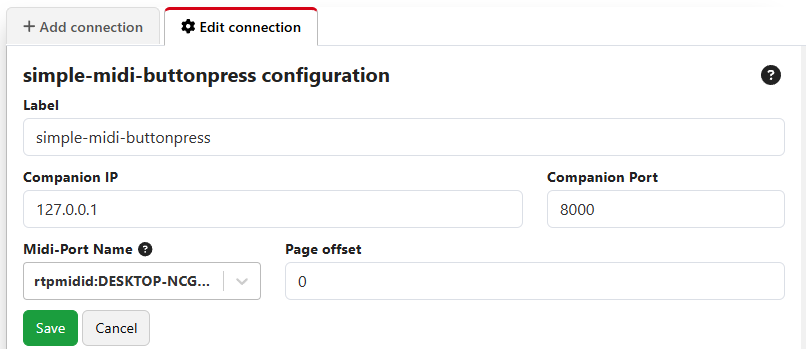

## Simple MIDI button press

This module doesn't provide any actions, or feedbacks, or variables. It has only one purpose: to help you press Companion buttons using MIDI note on messages.

### Formatting your MIDI messages

This module uses a very simple mapping of Note-On MIDI messages to buttons in Companion:

- Midi Channel = Button Page (but see later notes on the "page offset")
- The numerical value of the Note-On = Row of button
- Note-On Intensity = Column of button

For example, if you send a MIDI Note-On message on channel 1, note 0, velocity 0, then the module will "press" Companion's button 1/0/0 for you.

### Module configuration

After adding an instance of this module, you will need to configure it.

In simple cases, the only configuration you need to do is to choose an existing MIDI port in the "Midi Port Name" dropdown. If you are on MacOS or Linux, youcan also pick the last option "Custom Virtual Port" to create a local (non-networked) custom virtual port with any name you choose.

The module also needs to know the IP address and port number that your Companion is configured to listen to (if you have changed it from the defaults) as there is no way for this module to "know" these details (which are configured in the main window of Companion).

The available fields are:

- **Companion IP**: The IP address the module should use to access Companion's HTTP API. Normally the default of 127.0.0.1 will work, unless you are doing something funky with binding Companion to network adapters.
- **Companion Port**: The network port the module should use to access Companion's HTTP API. Normally the default of 127.0.0.1 will work, unless you have changed this.
- **MIDI-Port Name**: Here you should select the MIDI port to listen on. On MacOS and Linux, you can use a virtual MIDI port by selecting "Custom Virtual Port"
- **Virtual Midi Port Name**: If you selected "Custom Virtual Port", you can name that virtual port here.
- **Page offset**: By default, this module will let you "press" buttons on Companion pages 1 to 16. If you need to access a different range of pages, you can set an offset here - e.g. if you pick a page offset of 99, then this module will let you "press" buttons on Companion pages 100 to 115.

### Enabling RTPMidi on Raspberry Pi

If you are running CompanionPi, and want to use an RTP Midi connection from another computer, you can install this by [following these instructions](https://discourse.checkcheckonetwo.com/t/how-to-install-rtpmidi-on-raspberrypi-or-other-linux-sbc/4111), sending the following commands through an ssh connection to your CompanionPi:

    wget https://github.com/davidmoreno/rtpmidid/releases/download/v23.12/rtpmidid_23.12_arm64.deb
    sudo dpkg -i rtpmidid_23.12_arm64.deb
    sudo apt -f install
